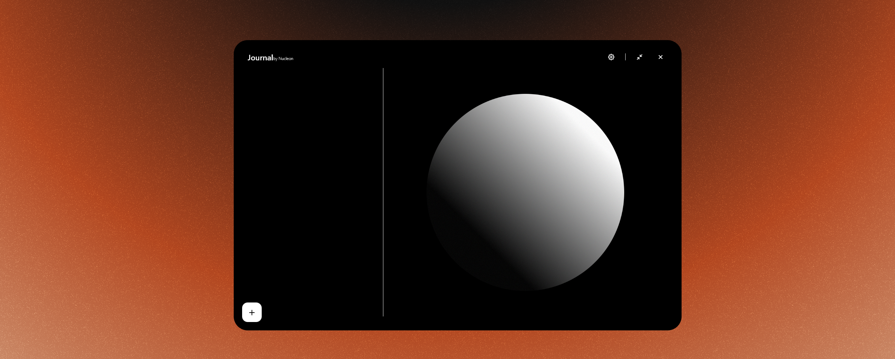
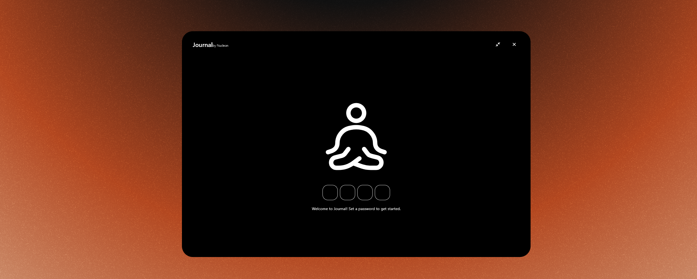
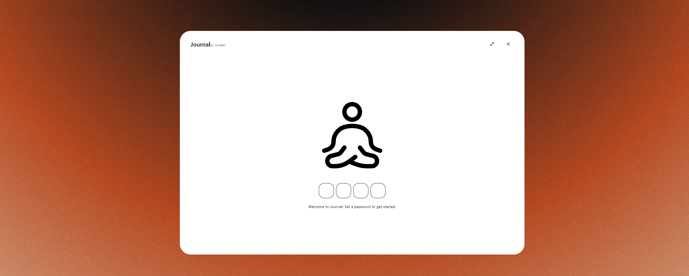

A small Journal Desktop-App, written in Dart using Flutter.

by Lennart S. @ Nucleon Interactive

Dark Mode           |  Light Mode
:-------------------------:|:-------------------------:
  |  

### Other Features
- *optional* Data Encryption
- Markdown Syntax & Emojis (*also Math*)
- Dark & Light Mode

### More Screenshots

Dark Mode           |  Light Mode
:-------------------------:|:-------------------------:
  |  
  |  
  |  

## How to use

To get started, simply head over to the Releases section (top right panel) and download the latest version of the binaries.
Once downloaded, extract the ZIP file and run journal.exe. Windows may display a warning. You can safely bypass it.

*Disclaimer: Currently, only Windows is officially supported. However, the code for Linux and macOS is ready — it just needs to be compiled. Volunteers welcome!*

## How to modify

To modify and compile the application yourself, you’ll need access to my custom design library, **NucleonDesign** (*which may be open-sourced in the future*).
Alternatively, you can bypass this requirement by implementing the necessary widgets yourself.

You'll also need to provide your own implementation of the **Encrypter** class, which is not included in this repository for security reasons.

To work properly with the **EncryptionService** class, your custom **Encrypter** should implement the following methods:

```dart
class Encrypter {
    static String encryptionKey = '...';

    static String encryptData(String data, String password) {
        ...
        return enryptedData;
    }

    static String decryptData(String encoded, String password) {
        ...
        return decodedData;
    }
}
```

---

*Disclaimer: This code was put together in just about 2 days, so it's a bit rough around the edges. Improvements will come as long as I keep working on it.*